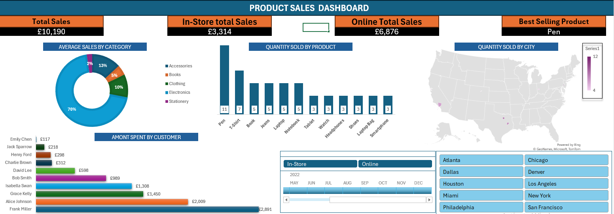

# PROJECT 1
**TITLE:** [Sales Interactive Dashboard](https://github.com/Illumineofficial/Illumineofficial.github.io/blob/main/Sales%20Accts%20Real.xlsx)

**TOOLS USED:** Microsoft Excel (Pivot Chart, Pivot tables, Conditional formating, filters, slicers, map, timelines)

**PROJECT DESCRIPTION:** Executive Sales Overview Dashboard: This dashboard delivers key sales insights in a concise and visually engaging format. It highlights total sales, split into in-store and online performance, with figures for the best-selling product and average sales by category. Detailed analytics include quantity sold by product, city-wise sales distribution, and customer spending trends. A slicer allows stakeholders to filter data by city, and a timeline provides an overview of sales trends over time. Designed for strategic decision-making, this dashboard offers a clear and actionable view of business performance to drive informed discussions and planning.

**KEY FINDINGS:** 
1. **Total Sales Performance**: A clear view of overall sales trends, revealing whether sales targets are being met across in-store and online channels.

2. **Best-Selling Product**: Identification of the top-performing product, which could guide inventory planning and marketing strategies.

3. **Category Analysis**: Average sales by category highlight which product categories are driving the most revenue, helping prioritize resource allocation.

4. **Regional Trends**: Quantity sold by city reveals top-performing and underperforming locations, offering insights for regional marketing efforts or store expansions.

5. **Customer Spending**: Analysis of customer spending patterns helps understand customer behavior, enabling more tailored sales or loyalty programs.

6. **Product-Level Insights**: Quantity sold by product uncovers high-demand products, which can inform stock management and pricing strategies.

7. **Time-Based Trends**: The timeline provides visibility into seasonal or temporal sales trends, aiding in demand forecasting and promotional planning.

**DASHBORD OVERVIEW:**

# PROJECT 2
**TITLE:** Employee Records Cleaning

**SQL CODE:** [SQL queries](https://github.com/Illumineofficial/Illumineofficial.github.io/blob/main/Employee_data.sql)

**SQL SKILLS USED:**
1.	**Data Cleaning and Preparation**
	Used SQL queries to handle missing values, standardize data formats, and clean inconsistent entries.
	Techniques: CASE statements, IS NULL, TRIM(), UPPER()/LOWER(), etc.
 
 2.	**Data Aggregation**
	Summarized employee data using functions like SUM(), COUNT(), AVG(), MIN(), and MAX().
	Group data by key metrics using GROUP BY.
 
 3.	**Joins and Relationships**
	Combined data from multiple tables using joins (INNER JOIN, LEFT JOIN, etc.).
	Understand relationships like employees and their departments, projects, or supervisors.
	
 4.	**Filtering and Conditional Logic**
	Extracted subsets of data using WHERE, HAVING, and BETWEEN.
	Apply complex conditions to segment employees (e.g., by salary range, age, or performance).
	
 5.	**Window Functions**
	Used ROW_NUMBER(), RANK(), and PARTITION BY to analyze trends and comparisons within groups (e.g., tenure ranking).

	
 6.	**Case Studies or Metrics**
	Analyze KPIs such as employee retention, turnover rates, or performance metrics.
	Create reports for salary distributions, department headcounts, or hiring trends.
	
 7.	**Database Design and Normalization**
	Understand the structure of employee databases, ensuring efficient querying and storage.
  	Creating Reports
	Generate summary tables and export data for visualization.

**PROJECT DESCRIPTION:**
Employee Database Analysis: Optimizing Workforce Insights and Efficiency
Conducted an in-depth analysis of an employee database using SQL to derive actionable insights for workforce management. Tasks included cleaning and preparing raw employee data, generating department-specific metrics. Utilized advanced SQL techniques such as window functions, joins, and aggregate functions to summarizE salary distributions. Delivered a comprehensive report highlighting data-driven recommendations as demanded by the stakeholder

**Technology used:** SQL server
